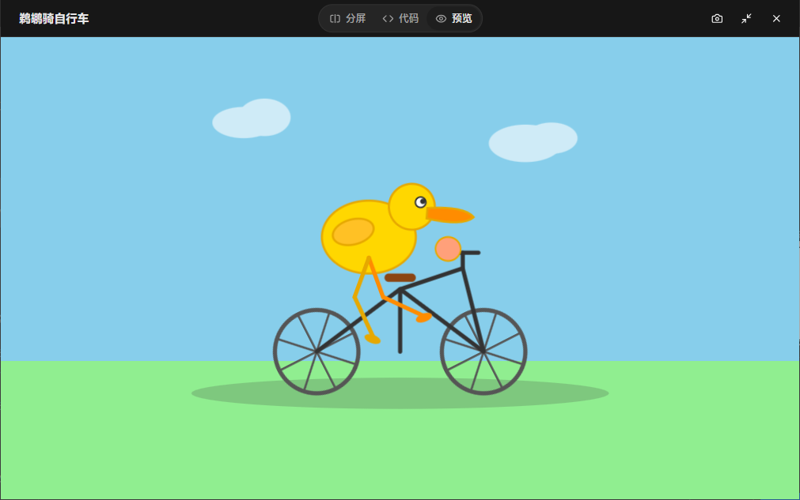

# autonavi-openai completion

把某导航软件 AI 聊天封装成一个 **OpenAI 兼容**的本地 HTTP 服务。

**本仓库仅供学习研究，未绑定账号下上下文仅有 2k，请勿用作违反中华人民共和国法律行为的用途！！！**

底层走的是 App 真实使用的通义百炼 `multimodal-dialog` WebSocket 协议（`wss://cmg-ws-mit.amap.com/ws/voice_chat`），协议与握手常量均通过 MITM 抓包逆向得到。

## 特性

- `POST /v1/chat/completions`（支持 `stream` 与非流式）、`GET /v1/models`、`GET /health`
- **提示词注入式 tool call**：上游不支持原生函数调用，用提示词让模型输出约定的
  `<<<TOOL_CALL>>>` 块，服务端解析后回标准 OpenAI `tool_calls`，由客户端执行并回灌
- 多轮记忆可控：`XIAODE_RANDOM_DIU=1` 随机化设备 ID，以尝试支持更大的上下文
- 默认剥离账号 PII（`uid`/昵称/手机号…），可用开关恢复

## 快速开始

```bash
python xiaode_openai.py 8790            # 默认端口 8790
```

```bash
curl http://127.0.0.1:8790/v1/chat/completions \
  -H 'Content-Type: application/json' \
  -d '{"model":"xiaode","messages":[{"role":"user","content":"你好"}]}'
```

> Windows 下 `curl` 会把中文按 GBK 编码，测试中文建议用 Python `urllib`。

### Python 调用

```python
import json, urllib.request

req = urllib.request.Request(
    "http://127.0.0.1:8790/v1/chat/completions",
    data=json.dumps({"model": "xiaode",
                     "messages": [{"role": "user", "content": "你好"}]}).encode(),
    headers={"Content-Type": "application/json"})
print(json.loads(urllib.request.urlopen(req, timeout=90).read()))
```

## 接口

### `POST /v1/chat/completions`

标准 OpenAI Chat Completions 请求体。额外行为：

| 字段 | 说明 |
|------|------|
| `messages` | **整个历史**都会被拍平后发出去（无状态） |
| `stream` | `true` 返回 SSE 流；`false` 返回单个 JSON |
| `tools` / `functions` | 走提示词注入式工具调用，命中时返回 `finish_reason:"tool_calls"` |
| `tool_choice:"none"` | 关闭工具调用 |

### `GET /v1/models`

```json
{"object":"list","data":[{"id":"xiaode","object":"model","owned_by":"amap"}]}
```

## 环境变量

| 变量 | 默认 | 作用 |
|------|------|------|
| `XIAODE_RANDOM_DIU` | `0` | `1` = 每次请求随机化设备 ID（URL `diu/adiu` + payload `adiu`），隔离上游设备级记忆 |
| `XIAODE_KEEP_ACCOUNT` | `0` | `1` = 从 `account.json` 注入账号字段（默认剥离 PII） |
| `XIAODE_MAX_TEXT` | `2000` | 发给上游的 `text` 最大字符数（上游硬上限约 2000，超出会 `task-failed` 并断连） |

## 文件

| 文件 | 说明 |
|------|------|
| `xiaode_openai.py` | 服务主体（HTTP 服务 + WS 协议封装 + tool call） |
| `frames/runtask.json` | `run-task`（`directive:"Start"`）帧模板 |
| `frames/respond.json` | `continue-task`（`directive:"RequestToRespond"`）帧模板 |
| `account.json` | 账号身份（`uid`/昵称/手机号…），默认不下发，仅 `XIAODE_KEEP_ACCOUNT=1` 时注入 |
| `aos_sign.py` | 高德 AOS 通用请求签名的离线复现（`sign = MD5(...).upper()`） |

> 服务是**自包含**的：`frames/` 随仓库一起分发，克隆本目录即可直接运行，不依赖仓库外的任何文件。

## 工作原理

### 握手

```
GET /ws/voice_chat?bizType=16&dip=10880&appkey=672ec8ef
    &sdkver=V1.4.7-02E-202608252026&div=ANDH170000
    &tid=asetDgCP8Y8DAJD5O1LEzGy1&keepAlive=60
    &diu=<diu>&adiu=<diu>&csid=<uuid>&sign=a67286934fd4440ee701baec6b6298ce
Host: xxx:443
Upgrade: websocket
Authorization: bearer          ← 空值即可
```

- `sign` 在抓包中**恒定**：它是通义 NLS SDK（`libnui.so` 的 `NUI_UTILS_MD5`）对固定输入算出的 MD5，输入全是构建期常量，所以对本版本 App 是常量。
- 校验项：URL 里的 `tid` / `sign` / `appkey` / `bizType`（绑定）。
- **不校验**：`diu` / `adiu` / `div` / `sdkver`，以及所有账号字段。

### 帧序列

```
C→S  run-task        (directive:"Start")
C→S  continue-task   (directive:"RequestToRespond", text:"<用户输入>")
C→S  finish-task     (directive:"Stop")
S→C  task-started → Started
S→C  RespondingContent  ×N   (流式文本；finished:true 结束)
S→C  task-finished / Stopped
```

### 多轮记忆

上游按 **`conversation_id`**（整会话固定 = 会话首条 `task_id`）+ **`adiu`** 记忆。
本项目默认走**无状态**：每次请求 `conversation_id` 用本轮自己的 `task_id`，
上下文完全靠 `text` 携带，因此客户端需要把完整历史发过来。

## Tool call（提示词注入）

上游没有原生 function calling，这里用提示词模拟。关键点：

- **不能**对模型说「你有工具/你必须调用工具」——它会拒绝（人设冲突）；
- 要把它当作**格式转换任务**：「把用户请求转换成函数调用 JSON，只输出这个块」。

模型命中时输出：

```
<<<TOOL_CALL>>>
{"name":"query_inventory","arguments":{"sku":"SKU-7788"}}
<<<END_TOOL_CALL>>>
```

服务端解析后返回标准结构：

```json
{"finish_reason":"tool_calls",
 "message":{"role":"assistant","content":null,
   "tool_calls":[{"id":"call_...","type":"function",
     "function":{"name":"query_inventory","arguments":"{\"sku\": \"SKU-7788\"}"}}]}}
```

客户端执行函数后，以 `role:"tool"` 回灌，即可得到最终回答（完整 agent loop）。

## 日志

运行日志同时输出到 `stderr` 与 `xiaode.log`，包含：请求概要（消息数 / stream /工具数 / prompt 长度）、上游 WS 的连接与帧收发、异常类型 + 完整 traceback、截断告警、404/414 记录。

## 免责声明

仅供学习研究。

## 彩蛋：鹈鹕骑车测试效果
